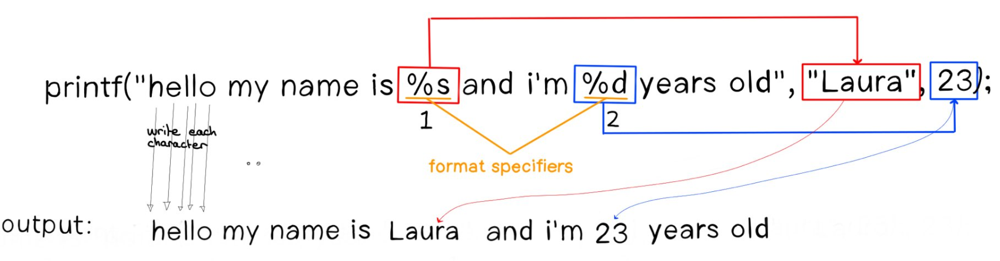

# ft_printf
The goal of this project is simple: replicate the printf function.

In a nutshell, the printf function is a command to display a formatted string on the screen. 

The word "format" means that format specifiers, which begin with the % character, indicate the location and method of converting a data element (such as a number) into characters. 

Let's take an example. 

First, to use the printf function on C, you must include the "stdio" library (standard input/output).

````
#include <stdio.h>

int main()
{
	printf("hello my name is Laura and i'm 23 years old\n");
	printf("hello my name is %s and i'm %d years old\n", "Laura", 22);
}
````

On line 5 I did a printf of a simple string. On the next line, on line 6, I used the format specifiers so you can understand it better. 

Both functions will return the same thing but it's in the construction that they differ. 




At the beginning of the sentence, each character is copied/written literally into the function's output. Then, when the function finds a format specifier (which starts with a % character), it will retrieve the argument that is in the same position and write it in a very specific way.

For example when it finds the first %, it looks at what type it is. In our example, the first one is "s" so it will treat the first argument as a string, and use a specific method to copy this element into the function output. It will do the same thing when it finds the next %. Etc. 

## Format specifiers
The character after a '%' has different meanings. Let's just look at the ones we need to realize this project for school 42.

| Character | Description |
|-----------|-------------|
| `%` | Prints a % character. |
| `d`, `i` | Print an int as a signed integer. `%d` and `%i` are synonymous for output, but are different when used with `scanf` for input (where using `%i` will interpret a number as hexadecimal if it's preceded by `0x`, and octal if it's preceded by `0`.) |
| `u` | Print decimal unsigned int. |
| `x`, `X` | Print an unsigned int as a hexadecimal number. `x` uses lower-case letters and `X` uses upper-case. |
| `s` | Print a null-terminated (`\0`) string. |
| `c` | Print a single character (`char`). |
| `p` | Print the address of a pointer or any other variable. The output is displayed in hexadecimal value. It's a format specifier which is used if we want to print data of type `(void *)`. |

## Return value (int)
The prototype of the printf function is constructed like this:

`int	ft_printf(const char *format, ...);`

As you can see, the printf function returns a value of type int. But why ?

In short, it is mainly about checking for errors. You can make sure that the operation was successful or not using the return value. Checking the return value of printf allows you to detect failure early so you don't waste time attempting to write millions of lines when the first line already failed.

If a positive value is returned (indicating the number of characters written) it means the operation was successful. 

If a negative number is returned there was some error.

If you want to check what value the function returns, you can do a printf of your printf.

```
int main()
{
    int result = printf("Sentence to know how many %s\n", "characters were written");
    
    printf("%d characters were written", result);
}
```

# Variadic functions
This is the new concept that we learn during this project. It is essential to understand it well before moving on.

The functions you have used and created so far in your course had fixed arguments. There could be several, but you always knew in advance what arguments you would need.

For example strlen only takes a string as input (int ft_strlen(char *str)) and split takes two elements as input (**ft_split(char const *s, char c)). You get the idea.

A variadic function is a function which accepts a variable number of arguments. It is characterized by the "..." in a function. 
```
int	ft_printf(const char *format, ...);

// const char *format is the mandatory argument of printf
```
The variadic function must have at least one mandatory argument. There is no minimum for the number of variable arguments.